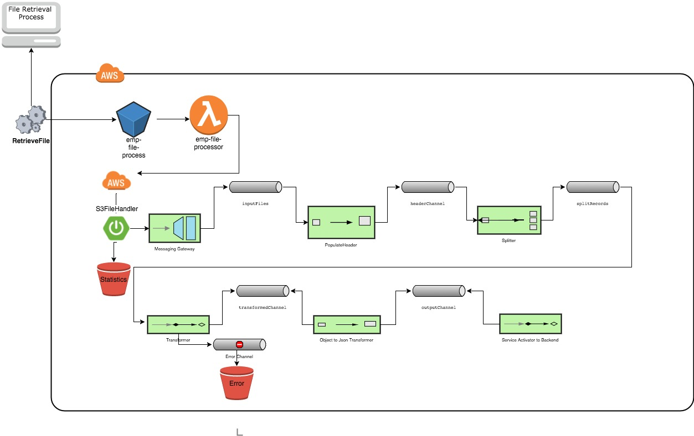

# serverless-springintg-file-processor
  
Demo for Serverless SpringIntegration Application running in SpringBoot Container.

Documentation at  - <https://medium.com/@pckeyan/running-spring-integration-as-aws-lambda-function-serverless-3c921550f0b0>

### Running the App Locally

java -jar -DbaseDir=<LOCAL_DIR> -DprocessingFilePattern=emp.txt build/libs/serverless-springintg-file-processor-boot-01.00.00.01.jar

_Sample File emp.txt is located in the src/main/test/resources._